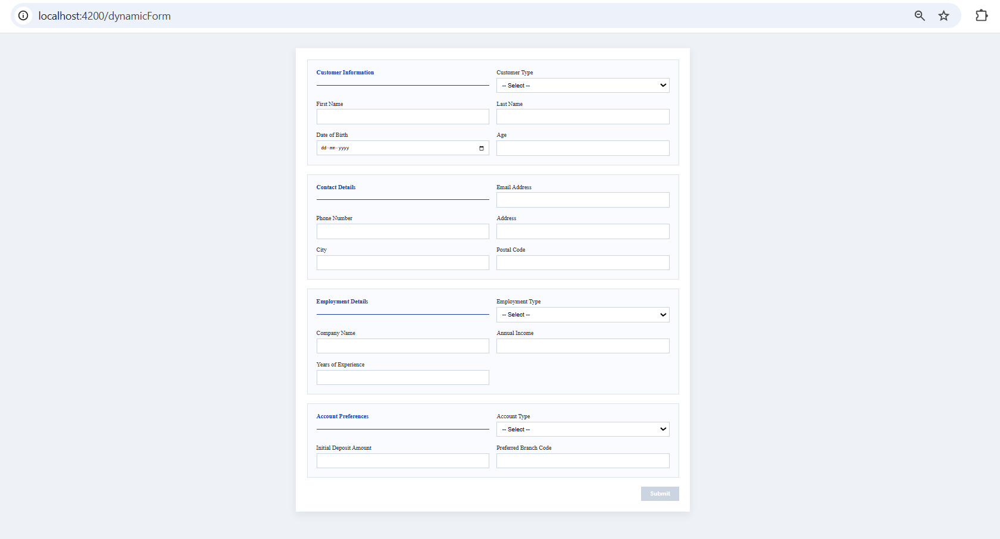

# MyApp

This project was generated using [Angular CLI](https://github.com/angular/angular-cli) version 20.3.8.

## Overview

This project implements a metadata-driven dynamic form engine using Angular 20 (standalone components + reactive forms).

The form structure (sections, fields, field types, and validations) is fully driven by backend JSON metadata (mocked using json-server). No fields are hardcoded in the UI.

The architecture is designed to scale to large enterprise forms while keeping separation of concerns, maintainability, and performance in mind.

## Run Instructions
### 1️⃣ Install dependencies
npm install


### 2️⃣ Start mock backend
npm run mock:server

Mock API runs at: http://localhost:3000/forms

Mock JSON file path:  mock-server/forms.json


### 3️⃣ Start Angular app
```bash
ng serve
```

Application runs at:  http://localhost:4200

Once the server is running, open your browser and navigate to `http://localhost:4200/`. The application will automatically reload whenever you modify any of the source files.

## Application Preview

### Dynamic Form UI Screenshot Reference Path
 


## Architecture Overview

### Feature Structure

features/
└── dynamic-form/
├── pages/
│ └── dynamic-form
├── components/
│ ├── form-section
│ ├── form-field
│ └── form-types/
│ ├── text-field
│ ├── number-field
│ ├── select-field
│ └── date-field
├── models/
└── services/

## Design Decisions

### 1️⃣ Metadata-Driven Rendering

All form sections and fields are generated dynamically from JSON metadata.

Why:
- Avoid hardcoded UI
- Allow backend-controlled form structure
- Enable scalability
- Improve reusability

### 2️⃣ Standalone Components

The application uses Angular standalone components.

Why:
- Reduced boilerplate
- Cleaner feature encapsulation
- Better modularity
- Improved maintainability

### 3️⃣ Custom Field Components

Each field type is implemented as a dedicated standalone component:

- TextField
- NumberField
- SelectField
- DateField

Why:
- Separation of UI logic
- Easier extension for new field types
- Cleaner switch logic
- Independent styling
- Scalable architecture

To add a new field type:
1. Create a new component under `form-types`
2. Add it in `form-field` switch logic
3. Extend the union type in the model

---

### 4️⃣ Reactive Forms + Dynamic Validators

Validation rules are defined in metadata and mapped dynamically inside `FormBuilderService`.

Supported validation types:

- required
- minLength
- maxLength
- min
- max
- pattern

This allows:
- Backend-driven validation rules
- Centralized validation mapping
- Easy extension for additional rules

---

### 5️⃣ Performance Considerations

The structure is designed with large-form scalability in mind.

Implemented optimizations:

- ChangeDetectionStrategy.OnPush
- trackBy usage in ngFor
- No template function calls
- Separation of rendering and form building logic
- Async data loading using Observables
- shareReplay to avoid duplicate API calls

The architecture can scale to larger forms without heavy change detection overhead.


## Styling & Maintainability

Styling is structured using SCSS partials.

SCSS Structure:

styles.scss (entry point)
styles/
 ├── _variables.scss
 ├── _base.scss
 ├── _forms.scss
 └── _buttons.scss


Styling Strategy:

- CSS design tokens defined using variables
- Centralized color palette
- Reusable spacing, color, background and radius values
- 2-column grid layout using CSS Grid
- Modular SCSS organization for maintainability

## Extensibility

Supports extensibility :

- Add new field type
- Add new validation rule
- Add conditional visibility
